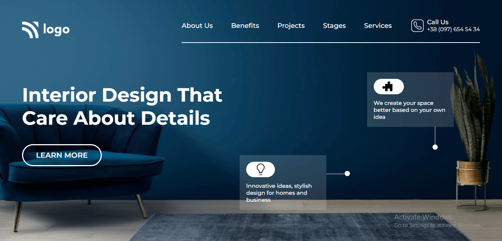

# Portfolio Project 10

## Description

This project is a landing page for a company that provides interior design solutions to homes and businesses. This project is created using HTML and CSS and is responsive for both mobile and tablet screens.

**Created By :** Shubham Purwar

**Time took to complete the project :** 4 hours

## What I learnt by creating this project :-

- How to add a cover image using CSS `background` properties
- How to use CSS `::before` and `::after` psuedo-selectors to create a design
- How to create `translucent cards` and position them in a web page

### Preview of the project :-

### [Live link](https://portfolio-project-10.vercel.app/) of the project.
